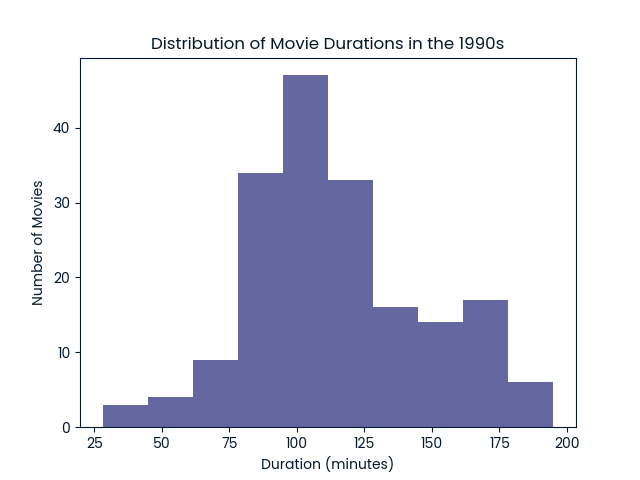

# 🎬 Netflix Movies — 1990s Exploratory Data Analysis


## 📌 Project Overview

This project performs **Exploratory Data Analysis (EDA)** on a Netflix dataset, focusing on movies released during the **1990s decade**. The analysis uncovers trends in movie durations and explores the action genre using Python.

This was completed as part of a guided project on **DataCamp**.

🔗 **[View Original DataCamp Project](https://www.datacamp.com/datalab/w/b1650165-0a29-466f-b823-b7d9ccf7ddef/edit)**

---

## 📂 Repository Structure

```
netflix-eda-1990s/
├── netflix_1990s_eda.ipynb                     # Main analysis notebook
├── netflix_1990s_duration_distribution.png     # Histogram visualization
├── netflix_data.csv                            # Dataset
└── README.md                                   # Project documentation
```

---

## 📊 Dataset

The dataset `netflix_data.csv` contains information about movies and TV shows available on Netflix, with the following columns:

| Column | Description |
|--------|-------------|
| `show_id` | Unique ID of the show |
| `type` | Movie or TV Show |
| `title` | Title of the show |
| `director` | Director of the show |
| `cast` | Cast of the show |
| `country` | Country of origin |
| `date_added` | Date added to Netflix |
| `release_year` | Year of release |
| `duration` | Duration in minutes |
| `description` | Description of the show |
| `genre` | Genre of the show |

---

## 🔍 Key Steps

1. **Filtered** the dataset to keep only Movies released between 1990 and 1999
2. **Visualized** the distribution of movie durations using a histogram
3. **Identified** the most frequent movie duration
4. **Counted** the number of short Action movies (under 90 minutes)

---

## 📈 Visualization



---

## 🔑 Key Findings

- 🎥 **Total 1990s movies analysed:** 183
- ⏱️ **Most frequent movie duration:** 94 minutes
- 🎬 **Short Action movies (under 90 mins):** 7
- 🏆 **Top genres:** Action, Dramas, Comedies

---

## 🛠️ Tools & Libraries

- **Python** — core programming language
- **Pandas** — data filtering and analysis
- **Matplotlib** — data visualization

---

## 🚀 How to Run

1. Clone the repository:
```bash
git clone https://github.com/yourusername/netflix-eda-1990s.git
```

2. Install dependencies:
```bash
pip install pandas matplotlib
```

3. Open the notebook:
```bash
jupyter notebook netflix_1990s_eda.ipynb
```

---

## 👤 Author

**Your Name**  
[GitHub](https://github.com/yourusername) · [LinkedIn](https://linkedin.com/in/yourprofile)

---

## 📜 License

This project is open source and available under the [MIT License](LICENSE).
